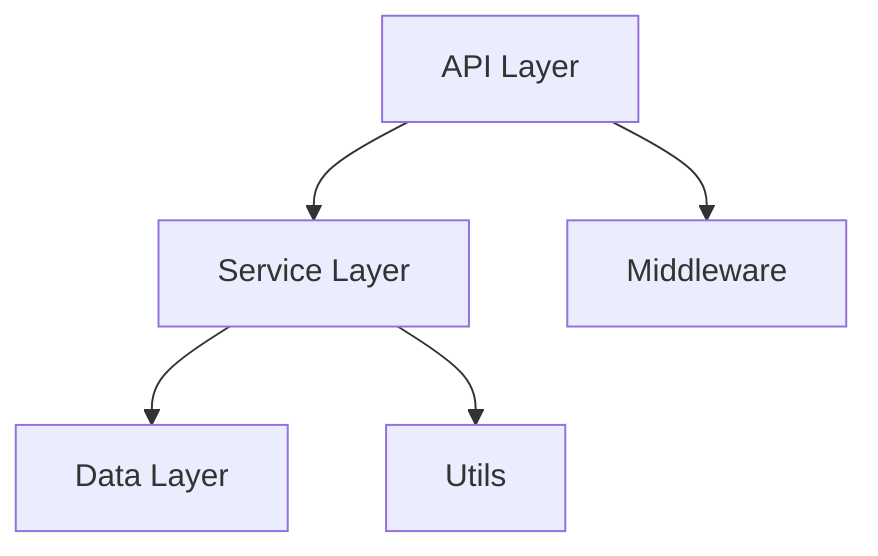

# /auto-doc - 自动文档生成器

自动分析代码并生成完整的文档，支持多种文档格式和风格。

## 功能特性

- 📚 自动生成 API 文档
- 📝 生成函数/类注释
- 🎨 支持多种文档格式
  - Markdown
  - JSDoc/TSDoc
  - Python Docstring (Google/NumPy/Sphinx)
  - JavaDoc
  - GoDoc
  - Rustdoc
- 🌐 生成静态文档网站
- 🔄 更新现有文档
- 📊 生成架构图和流程图
- 🌍 支持多语言文档

## 使用方法

```bash
# 基本用法 - 为单个文件生成文档
/auto-doc src/api.ts

# 为整个项目生成文档
/auto-doc src/

# 指定文档格式
/auto-doc src/utils.ts --format jsdoc
/auto-doc src/utils.py --format google

# 生成 Markdown 文档
/auto-doc src/ --output docs/ --format markdown

# 生成静态网站
/auto-doc src/ --site --output docs-site/

# 只更新缺失的文档
/auto-doc src/ --update-missing

# 生成中文文档
/auto-doc src/ --lang zh

# 包含示例代码
/auto-doc src/api.ts --examples

# 生成架构图
/auto-doc src/ --architecture
```

## What You Must Do When Invoked

当用户调用 `/auto-doc` 时，按以下步骤执行：

### Step 1 - 分析目标代码

```bash
TARGET="$1"

if [[ -f "$TARGET" ]]; then
    echo "📄 Analyzing file: $TARGET"
    FILES=("$TARGET")
elif [[ -d "$TARGET" ]]; then
    echo "📁 Analyzing directory: $TARGET"
  FILES=($(find "$TARGET" -type f \( -name "*.ts" -o -name "*.js" -o -name "*.py" -o -name "*.java" -o -name "*.go" -o -name "*.rs" \)))
else
    echo "❌ Target not found: $TARGET"
    exit 1
fi

echo "Found ${#FILES[@]} file(s) to document"
```

### Step 2 - 识别语言和文档风格

```bash
case "$TARGET" in
    *.ts|*.tsx)
   LANGUAGE="typescript"
        DEFAULT_FORMAT="tsdoc"
  ;;
    *.js|*.jsx)
        LANGUAGE="javascript"
        DEFAULT_FORMAT="jsdoc"
        ;;
    *.py)
        LANGUAGE="python"
        DEFAULT_FORMAT="google"  # or numpy, sphinx
        ;;
    *.java)
        LANGUAGE="java"
   DEFAULT_FORMAT="javadoc"
        ;;
    *.go)
        LANGUAGE="go"
        DEFAULT_FORMAT="godoc"
      ;;
    *.rs)
        LANGUAGE="rust"
        DEFAULT_FORMAT="rustdoc"
        ;;
esac

FORMAT="${FORMAT:-$DEFAULT_FORMAT}"
echo "🔍 Language: $LANGUAGE, Format: $FORMAT"
```

### Step 3 - 分析代码结构

读取代码并提取：

1. **模块/包信息**
   - 模块名称
   - 模块描述
   - 导入依赖

2. **类/接口**
   - 类名
   - 类描述
   - 属性列表
   - 方法列表

3. **函数/方法**
   - 函数名
   - 参数（名称、类型、默认值）
   - 返回值类型
   - 功能描述
   - 异常/错误

4. **类型定义**
   - 接口
   - 类型别名
   - 枚举

### Step 4 - 生成文档注释

根据语言和格式生成相应的文档注释：

#### TypeScript/TSDoc 示例

```typescript
/**
 * 计算购物车商品总价
 * 
 * @param items - 商品列表，每个商品包含价格和数量
 * @returns 所有商品的总价
 * 
 * @example
 * ```typescript
 * const items = [
 *   { price: 10, quantity: 2 },
 *   { price: 5, quantity: 3 }
 * ];
 * const total = calculateTotal(items);
 * console.log(total); // 35
 * ```
 * 
 * @throws {TypeError} 当 items 不是数组时抛出
 */
export function calculateTotal(
  items: Array<{ price: number; quantity: number }>
): number {
  if (!Array.isArray(items)) {
    throw new TypeError('items must be an array');
  }
  return items.reduce((sum, item) => sum + item.price * item.quantity, 0);
}

/**
 * 验证电子邮件地址格式
 * 
 * @param email - 要验证的电子邮件地址
 * @returns 如果格式有效返回 true，否则返回 false
 * 
 * @example
 * ```typescript
 * validateEmail('test@example.com'); // true
 * validateEmail('invalid-email'); // false
 * ```
 */
export function validateEmail(email: string): boolean {
  const regex = /^[^\s@]+@[^\s@]+\.[^\s@]+$/;
  return regex.test(email);
}
```

#### Python/Google Style 示例

```python
def calculate_total(items):
    """计算购物车商品总价。
    
    Args:
   items (list): 商品列表，每个商品是包含 price 和 quantity 的字典。
 例如: [{'price': 10, 'quantity': 2}]
    
  Returns:
        float: 所有商品的总价。
    
    Raises:
        TypeError: 当 items 不是列表时。
     ValueError: 当商品缺少必需字段时。
    
    Examples:
        >>> items = [
   ...     {'price': 10, 'quantity': 2},
        ...     {'price': 5, 'quantity': 3}
  ... ]
        >>> calculate_total(items)
        35
    
 Note:
        此函数不处理折扣或税费。
    """
    if not isinstance(items, list):
   raise TypeError('items must be a list')
    
    total = 0
    for item in items:
        if 'price' not in item or 'quantity' not in item:
       raise ValueError('item must have price and quantity')
      total += item['price'] * item['quantity']
 
    return total


class ShoppingCart:
    """购物车类，管理商品和计算总价。
  
    Attributes:
        items (list): 购物车中的商品列表。
        discount (float): 折扣率，范围 0-1。
    
    Examples:
        >>> cart = ShoppingCart()
        >>> cart.add_item({'price': 10, 'quantity': 2})
        >>> cart.get_total()
        20
    """
    
    def __init__(self, discount=0):
        """初始化购物车。
        
        Args:
  discount (float, optional): 折扣率。默认为 0。
        """
        self.items = []
        self.discount = discount
    
    def add_item(self, item):
     """添加商品到购物车。
        
        Args:
   item (dict): 包含 price 和 quantity 的商品字典。
        
     Raises:
            ValueError: 当商品格式无效时。
        """
      if 'price' not in item or 'quantity' not in item:
     raise ValueError('Invalid item format')
  self.items.append(item)
    
    def get_total(self):
        """计算购物车总价（含折扣）。
        
        Returns:
        float: 应付总价。
        """
     subtotal = calculate_total(self.items)
        return subtotal * (1 - self.discount)
```

### Step 5 - 生成 Markdown 文档

如果指定 `--format markdown`，生成独立的 Markdown 文档：

```markdown
# API 文档

## 模块: utils

购物车工具函数集合。

### 函数

#### calculateTotal

计算购物车商品总价。

**签名:**
```typescript
function calculateTotal(items: Array<{price: number, quantity: number}>): number
```

**参数:**
- `items` (Array): 商品列表，每个商品包含价格和数量

**返回值:**
- `number`: 所有商品的总价

**示例:**
```typescript
const items = [
{ price: 10, quantity: 2 },
  { price: 5, quantity: 3 }
];
const total = calculateTotal(items);
console.log(total); // 35
```

**异常:**
- `TypeError`: 当 items 不是数组时抛出

---

#### validateEmail

验证电子邮件地址格式。

**签名:**
```typescript
function validateEmail(email: string): boolean
```

**参数:**
- `email` (string): 要验证的电子邮件地址

**返回值:**
- `boolean`: 如果格式有效返回 true，否则返回 false

**示例:**
```typescript
validateEmail('test@example.com'); // true
validateEmail('invalid-email'); // false
```
```

### Step 6 - 生成静态文档网站（可选）

如果指定 `--site`，使用文档生成工具：

```bash
case "$LANGUAGE" in
    typescript|javascript)
    # 使用 TypeDoc
        npx typedoc --out "$OUTPUT_DIR" "$TARGET"
        ;;
    python)
        # 使用 Sphinx
        sphinx-quickstart "$OUTPUT_DIR"
        sphinx-build -b html "$TARGET" "$OUTPUT_DIR"
        ;;
    java)
        # 使用 JavaDoc
        javadoc -d "$OUTPUT_DIR" "$TARGET"
  ;;
    go)
        # 使用 godoc
  godoc -http=:6060
      ;;
    rust)
   # 使用 cargo doc
      cargo doc --open
        ;;
esac

echo "📄 Documentation site generated: $OUTPUT_DIR/index.html"
```

### Step 7 - 更新源代码文件

如果不是生成独立文档，而是更新源代码中的注释：

```bash
# 读取原文件
ORIGINAL_CONTENT=$(cat "$SOURCE_FILE")

# 插入生成的文档注释
# 使用 Edit 工具更新文件
```

### Step 8 - 生成架构图（可选）

如果指定 `--architecture`，生成项目架构图：

```bash
# 分析模块依赖关系
# 生成 Mermaid 图表

cat > "$OUTPUT_DIR/architecture.md" << 'EOF'
# 项目架构



## 模块说明

- **API Layer**: 处理 HTTP 请求和响应
- **Service Layer**: 业务逻辑处理
- **Data Layer**: 数据库访问
- **Utils**: 工具函数
- **Middleware**: 中间件（认证、日志等）
EOF
```

### Step 9 - 总结报告

```bash
echo ""
echo "━━━━━━━━━━━━━━━━━━━━━━━━━━━━━━━━━━━━━━━━"
echo "📚 Documentation Generation Summary"
echo "━━━━━━━━━━━━━━━━━━━━━━━━━━━━━━━━━━━━━━━━"
echo "Source: $TARGET"
echo "Format: $FORMAT"
echo "Files documented: ${#FILES[@]}"
echo "Output: $OUTPUT_DIR"
echo ""
echo "Next steps:"
echo "1. Review generated documentation"
echo "2. Adjust descriptions as needed"
echo "3. Commit documentation to repository"
echo "━━━━━━━━━━━━━━━━━━━━━━━━━━━━━━━━━━━━━━━━"
```

## 示例

### 示例 1：为 TypeScript 文件生成 TSDoc

**输入:**
```bash
/auto-doc src/utils.ts --format tsdoc
```

**输出:**
```
📄 Analyzing file: src/utils.ts
🔍 Language: typescript, Format: tsdoc
📝 Analyzing code structure...
   Found 2 functions: calculateTotal, validateEmail
📚 Generating documentation...
✅ Documentation added to: src/utils.ts

━━━━━━━━━━━━━━━━━━━━━━━━━━━━━━━━━━━━━━━━
📚 Documentation Generation Summary
━━━━━━━━━━━━━━━━━━━━━━━━━━━━━━━━━━━━━━━━
Source: src/utils.ts
Format: tsdoc
Files documented: 1
Functions documented: 2

Next steps:
1. Review generated documentation
2. Adjust descriptions as needed
3. Commit documentation to repository
━━━━━━━━━━━━━━━━━━━━━━━━━━━━━━━━━━━━━━━━
```

### 示例 2：生成 Markdown API 文档

**输入:**
```bash
/auto-doc src/ --format markdown --output docs/api/
```

**输出:**
```
📁 Analyzing directory: src/
Found 8 file(s) to document
📚 Generating Markdown documentation...

✅ docs/api/utils.md
✅ docs/api/api.md
✅ docs/api/models.md
✅ docs/api/services.md
✅ docs/api/middleware.md
✅ docs/api/config.md
✅ docs/api/types.md
✅ docs/api/constants.md

📄 Generated index: docs/api/README.md

━━━━━━━━━━━━━━━━━━━━━━━━━━━━━━━━━━━━━━━━
📚 Documentation Generation Summary
━━━━━━━━━━━━━━━━━━━━━━━━━━━━━━━━━━━━━━━━
Source: src/
Format: markdown
Files documented: 8
Output: docs/api/

Next steps:
1. Review generated documentation
2. Open docs/api/README.md to browse
3. Commit documentation to repository
━━━━━━━━━━━━━━━━━━━━━━━━━━━━━━━━━━━━━━━━
```

### 示例 3：生成静态文档网站

**输入:**
```bash
/auto-doc src/ --site --output docs-site/
```

**输出:**
```
📁 Analyzing directory: src/
🌐 Generating static documentation site...
📦 Installing TypeDoc...
🔨 Building documentation...

✅ Documentation site generated!
📄 Open: docs-site/index.html

🌐 To serve locally:
 npx http-server docs-site/
   
   Then visit: http://localhost:8080
```

## 注意事项

- 生成的文档是基于代码结构的模板，需要人工审查和完善
- 复杂的业务逻辑需要手动补充说明
- 建议定期更新文档以保持同步
- 对于公共 API，建议添加详细的使用示例

## 依赖

根据语言和格式不同：
- **TypeScript/JavaScript**: typedoc, jsdoc
- **Python**: sphinx, pdoc3
- **Java**: javadoc (JDK 自带)
- **Go**: godoc (Go 自带)
- **Rust**: cargo doc (Cargo 自带)

## 配置

创建 `.auto-doc-config.json`：

```json
{
  "default_format": {
    "typescript": "tsdoc",
    "python": "google",
    "java": "javadoc"
  },
  "output_dir": "docs",
  "include_examples": true,
  "include_private": false,
  "language": "zh",
  "generate_index": true
}
```

## 相关 Skills

- `/auto-test` - 自动生成测试
- `/init` - 初始化 CLAUDE.md 文档

## 相关资源

- [TSDoc](https://tsdoc.org/)
- [JSDoc](https://jsdoc.app/)
- [Sphinx](https://www.sphinx-doc.org/)
- [TypeDoc](https://typedoc.org/)
